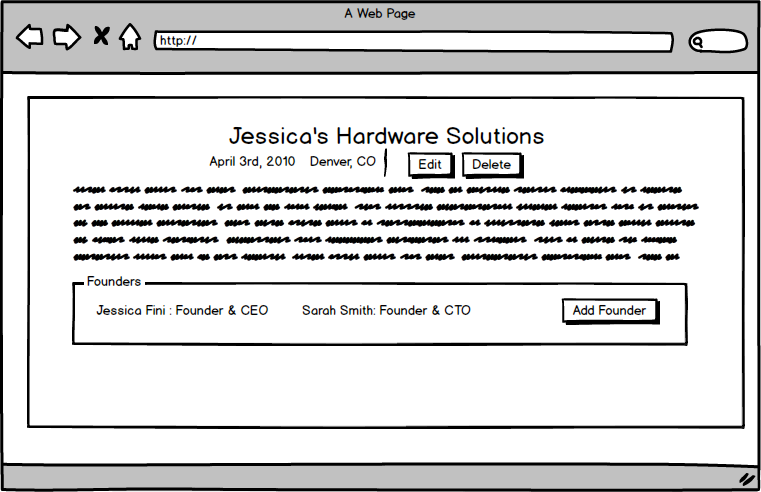

# Clearbridge Mobile Engineering: Fun Front to Back

Welcome to the Clearbridge Mobile Engineering Full Stack code Challenge. We work on diverse projects and value team members who can do it all from CSS to DevOps and everything inbetween. We love to code and are passionate about doing it well.

This is your chance to show the team how you approach problems and give us insight into your abilities. For the challenge, you are required to design, develop, and style a Full Stack application using Node as the API and React as the front-end. Feel free to use any third party libraries you see fit. You will have **4 days** to submit a solution for the given requirements. If you need more time due to schedule conflicts, just let us know. We value people with good communication skills. We strongly prefer that whatever you do, you do it well, as opposed to trying to razzle dazzle us. Please read all the instructions carefully and email us if you have any questions.

## Getting Started

First, fork this repository into your own GitHub account. Then complete each of the parts below, working as you would in a professional environment. Once you have completed all the sections, please update the README, to reflect how to build and run your application, as well as any architectural decisions you have made. Add your deployment url to your github repo so we can test the deployed application. When you believe you are ready to submit your challenge, submit a pull request into our master branch. We will see the notification and get back to you on next steps.

## What we are looking for

- Ability to set up a REST API (Node preferred).
- Ability to set up a Relational Database
- Understanding of the HTTP protocol and how it works with REST API conventions
- Understanding the basics of CRUD
  - Create
  - Read
  - Update
  - Delete
- Ability to layout and design an HTML page with CSS
- Ability to create an intuitive UI using a front-end framework (React preferred)
- Ability to use Javascript on the front-end to interact with a REST API
- Ability to develop automated tests for your application
- Ability to translate user stories into a web application
- Ability to deploy a front-end and back-end stack.

## The Challenge

### Intro

Build an application that will be a directory of companies, and the people who have founded them. The main page should be a list of all the companies with some high-level information (Name, Short Description, City, State). When the user clicks on a company, show its details. Included in those details will be the founding members of company and a long description.

### Part 1 : Companies Index

1. Create the basic layout for the page
2. Create a list view of all companies

- Company Name
- Company Location
- Short Description

3. Add ability to create a new company

### Part 2 : Companies Create

1. Implement form to create a new company
2. Fields
   - Company Name **required**
   - Company Location (City, State) **required**
   - Company Description **required**
   - Founded Date

### Part 3 : Company Details

1. Shows all of the Company's information
2. Ability to update Company
3. Ability to delete Company

### Part 4 : Founders

1. In the Company details add the ability to add a Founder to a Company.
2. Each Founder can only belong to a single company.
3. Founder Fields
   - Founder Full Name
   - Founder Title
4. Founders added should display in the company detail page.

### Part 5 : Tests

Create a test suite for your application, writing unit and or functional tests that adequately cover the code base. TDD-ers will have already completed this challenge.

### Part 6 : Deployment

Sign-up for a Heroku account or AWS (or other provider) and deploy your application to the web. Please provide us with the deployed URL. Please seed your application with at least a dozen Companies and Founders.

### Next Steps

If you move onto the next stage of the interview process we will have you come in and pair program with our engineers and build on top of your code base. Example features we might implement together would be to add category tags, add a search component or add images to Companies and Founders using a third party hosting service.
